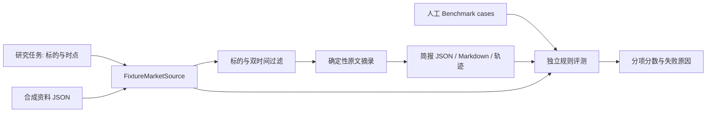

# 架构与数据流

## 当前实现

原有 `screen smoke` 的行情特征、评分与报告保持独立；本次没有把量价分数包装成新闻判断。

| 模块 | 职责 |
| --- | --- |
| `sources/market.py` | 类型校验、只读信息源接口、合成资料加载与历史筛选 |
| `agent/research.py` | 固定流程、摘录、信息不足状态和执行轨迹 |
| `evaluation/research.py` | Benchmark 加载、基于可信源核验、分项评分 |
| `reporting/research.py` | 中文简报与评测报告渲染 |
| `cli.py` | 输入校验、工作流入口、文件输出与退出码 |
| `benchmarks/research_cases.json` | 独立于输出文件的人工预期证据列表 |

## 时间语义

`published_at` 表示资料公开时间，`available_at` 表示研究系统首次可获得该版本的时间，`as_of` 表示研究时点。当前要求 `available_at >= published_at`，全部时间带时区。

一条资料被使用的条件：标的完全匹配；`as_of - max_age_days <= published_at <= as_of`；`available_at <= as_of`。边界包含等号；新鲜度按发布时间计算。

时间窗口是连续小时窗口，例如 1 天等于 24 小时，并非一个交易日。合成信息源按公开时间和 ID 稳定排序。相同 ID 完全相同只保留一次；内容不同抛错。跨 ID 的转载去重尚未实现。

## 证据与评测边界

每个 finding 包含类别、原文文本、证据 ID；完整证据随报告保存。评测时重新按 **case.task** 查询可信源，而非采用简报自己声明的时间，避免改写任务来放行未来信息。

评测逐字比较摘录与原文，并校验证据元数据。它可以识别原文篡改，不能证明原始发布者说的是真的，也不能为模型自由生成的解释提供语义支持。现阶段类别来自人工样例标签。可信源本身仍需要数据质量管理。

`trace` 记录检索参数、步骤及返回证据 ID，是固定工作流审计记录，尚不是可直接用于 RL 的完整训练轨迹。评测暂不验证轨迹的真实性，也不评分 `limitations` 中的自由文本。

## 可扩展边界

后续真实 provider 实现 `MarketSource.search(task)`，将原始文档保存在受控存储中，再生成有位置引用的证据。接入真实数据时需要相应调整当前 fixture 模式标识和报告，不能沿用合成标识混淆数据来源。

后续模型工作流可输出结构化 findings，但推理与改写需要单独 schema 和语义 Rubric；当前严格摘录核验应继续保留。真实数据/模型错误必须显式报告，不能静默切换为合成数据并继续声称真实研究成功。

## 输出与失败

文件按 UTF-8 保存；相同输出目录重跑会覆盖同名结果。生成 JSON 和 Markdown 目前不是原子事务，写入中断时应重跑并检查两者。输入异常退出 2，评测不通过退出 1 且保留诊断。

当前以无密钥离线演示为边界，没有定时调度、7x24 运行、联网抓取或模型服务。
